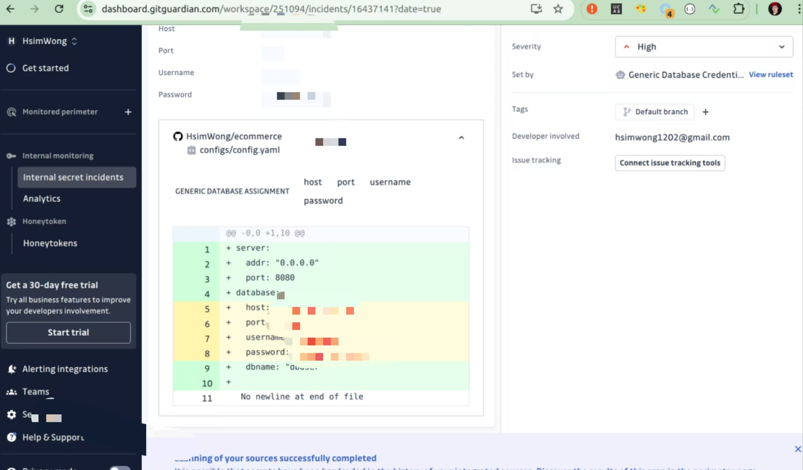

# 数据库密码被git追踪了！
## 背景
我没太经过专业的项目训练，所以图方便将配置文件通过git追踪了，推送到了github上。于是在今天上午就受到了这封邮件：

配置中有数据库相关的配置，而且是暴露在公网上的。好在，git仓库是私有的，而且项目本身不是很重要。


## 解决路径
使用如下命令进行解决
```
git filter-branch --force --index-filter \
"git rm --cached --ignore-unmatch 配置文件路径" \
--prune-empty --tag-name-filter cat -- --all
```
**1. git filter-branch​​** 
这是 Git 提供的用于重写历史记录的命令，可以修改提交历史（如删除文件、修改提交信息等）。

**​​2. --force​​**
​​强制执行操作，即使 Git 检测到可能的风险（如原始引用未被备份）。
​​为什么需要​​：默认情况下，filter-branch 会拒绝在未备份的情况下运行，--force 覆盖这一保护机制。

**​​3. --index-filter​​**
​​作用​​：指定一个命令，该命令会作用于 Git 的暂存区（index），而不是工作目录。
​​与 --tree-filter 的区别​​：
--tree-filter 会检出每个提交到工作目录，速度较慢。
--index-filter 直接操作暂存区，速度更快（适合仅删除文件）

​​**4. "git rm --cached --ignore-unmatch 配置文件路径"​​**
这是 --index-filter 的具体操作：
​​git rm --cached​​：从 Git 的暂存区删除文件（但保留工作目录中的文件）。
​​--ignore-unmatch​​：如果文件不存在，忽略错误（避免因文件在某些提交中不存在而中断）。
​​配置文件路径​​：要删除的文件路径（如 config/database.yml）。

**​​5. --prune-empty​​**
​​作用​​：删除因操作（如删除文件）而产生的空提交。
​​为什么需要​​：如果某个提交的唯一更改是删除的文件，则该提交会变为空提交，此选项会自动丢弃这些提交。

**​​6. --tag-name-filter cat​​**
​​作用​​：重写标签（tag）名称以匹配新的提交历史。
​​cat​​ 的含义：直接保留原标签名（不修改名称，仅更新指向的提交）。

**​​7. -- --all​​**
​​--​​：分隔符，表示后续参数是 git filter-branch 的选项，而非 --index-filter 的命令。
​​--all​​：对所有分支（包括远程分支）执行操作。

## 效果
使用后github所有分支上确实找不到相关的credentials了，而且提交日志也被留存下来，其他的提交不受影响

## 缺点
如果还留存着之前的`commit hash`，可以直接拼接地址看到原有的内容，只是会在顶端有提示：
```
This commit does not belong to any branch on this repository, and may belong to a fork outside of the repository.
```
## 结论
若要人不知，除非己莫为。不太能够完全删除。所以要养成良好的编程习惯。


